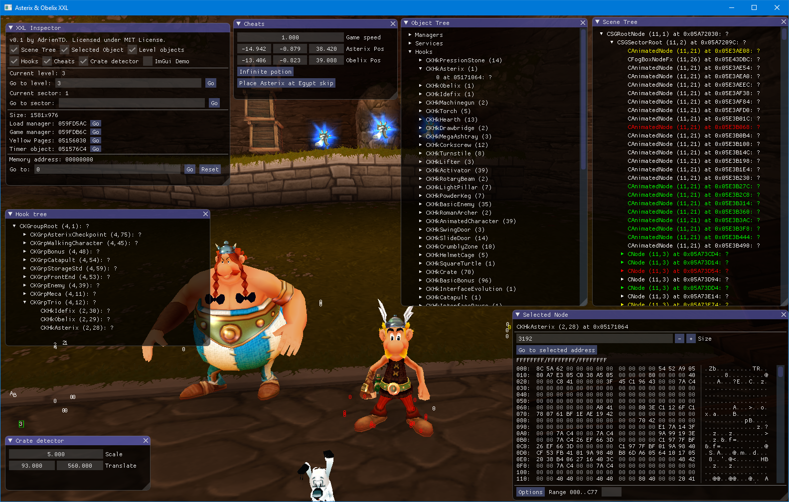

# XXL Inspector

Memory watcher and editor for all games from the Asterix XXL series (XXL1, XXL2 original, Olympic Games) on Windows PC.

Note: only tested with original French releases

## Features

* Load a level or sector at any time.
* Cheats: Teleport Asterix/Obelix, change the game speed, ...
* Visualization of the scene graph
* List of all loaded objects with class and instance names
* Look inside the memory of a game object
* Crate detector: displays all the positions of the active crate stacks on the screen, along with the number of crates in the stack. Useful for finding Tardis strats.

Note that some features are only available for specific games and not for all XXL games.

## Building

Visual C++ 2010 or later is required.

1. Open a Visual Studio x86 command prompt, or open the Windows SDK commmand prompt and set it to x86 mode (32-bit).
2. `cd` to this repository
3. Run the batch file:
   * `build_xxl1.bat` to build for Asterix & Obelix XXL 1.
   * `build_xxl2.bat` to build for Asterix & Obelix XXL 2: Mission Las Vegum.
   * `build_og.bat` to build for Asterix at the Olympic Games.

## Usage

Copy the resulting file `d3d9.dll` to the game's folder (where the `GameModule.elb` file is), and run the game.

It is recommended to run the game in windowed mode.

## Libraries used

* [ImGui](https://github.com/ocornut/imgui) for the GUI
* [ImGui Club](https://github.com/ocornut/imgui_club) for the memory editor control
